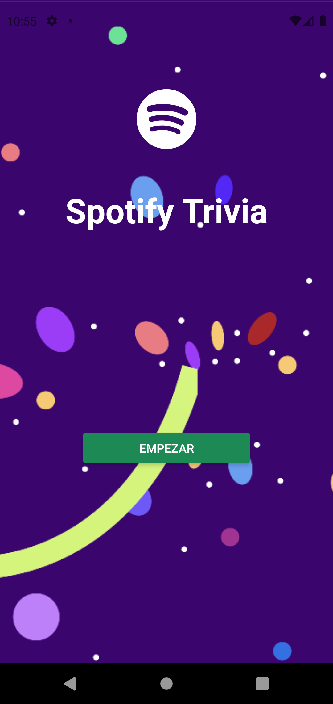
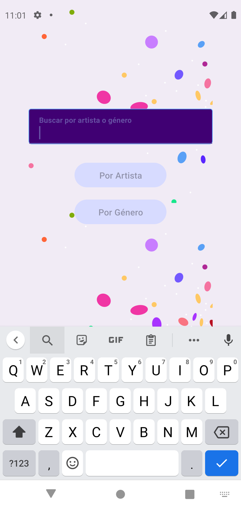
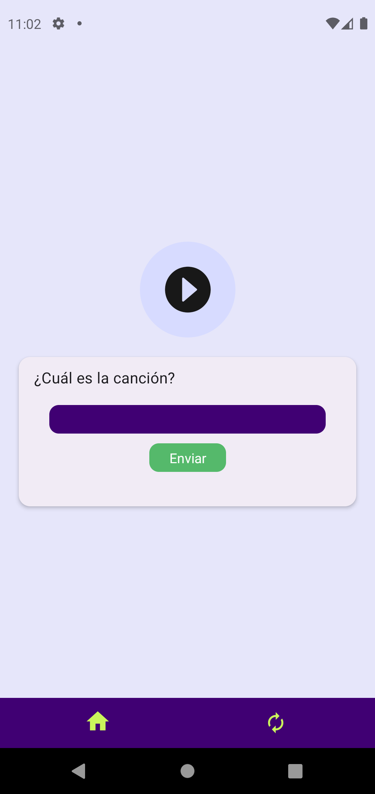
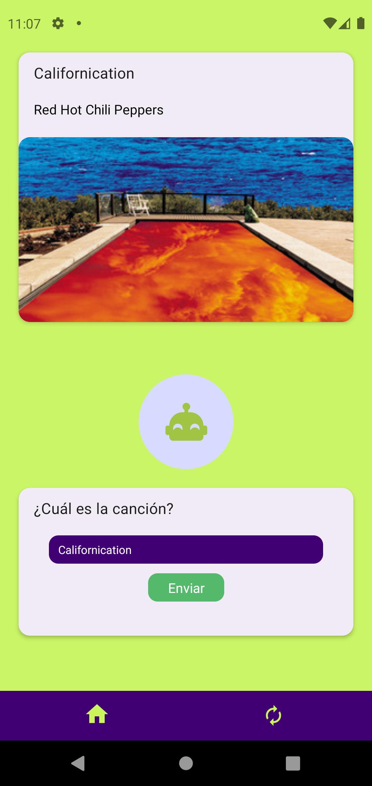
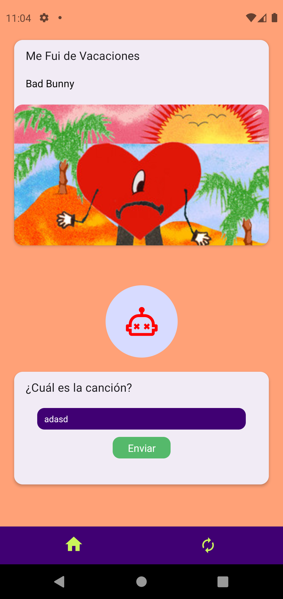

[](https://classroom.github.com/a/lkExPRSj)
# Laboratorio 05: Introducción a desarrollo mobile

## Instrucciones :page_facing_up:

- Individual
- Tiempo 120 minutos

## Objetivos :dart:

- Familiarizarse con `React Native` y `Expo`.
- Consumir un `API` externa.
- Identificar los casos de uso de un sistema.

## Instrucciones :mega:
### Prerrequisitos

Antes de comenzar este laboratorio, asegúrate de tener instalados los siguientes componentes en tu sistema:

- [Node.js](https://nodejs.org/) (versión LTS recomendada)
- [npm](https://www.npmjs.com/) o [Yarn](https://yarnpkg.com/) como gestor de paquetes
- [Expo CLI](https://docs.expo.io/get-started/installation/) instalado de forma global:

```shell
npm install -g expo-cli
```

### Instrucciones

Sigue estos pasos para configurar y ejecutar la aplicación de ejemplo en tu entorno de desarrollo:

1. Clona el repositorio duplicado del classroom en tu máquina local:

```shell
git clone <enlace de tu repositorio> react-native-lab
```

2. Navega al directorio del proyecto:

```shell
cd react-native-lab
```

3. Inicializa un nuevo proyecto

```shell
npx create-expo-app lab
# o
yarn create expo-app lab
```

4. Ingresa al proyecto creado

```shell
cd lab
```

5. Inicia el servidor de desarrollo:

```shell
npx expo start
# o
yarn expo start
```

6. Abre la aplicación Expo Go en tu dispositivo móvil (disponible en la App Store o Google Play) y escanea el código QR que aparece en la terminal.

7. Comienza a editar el código fuente en el directorio `src/` y observa cómo se reflejan los cambios en tiempo real en tu dispositivo móvil.

### Tareas del Laboratorio
> Este laboratorio es una versión móvil y aumentada del laboratorio introductorio a frontend.
 
#### 1. Seleccionar un `API` de alguno de estos hubs gratuitos:
- https://github.com/public-apis/public-apis
- https://api.nasa.gov

*puede utilizar una `API` diferente a las presentadas si así lo desea.

#### 2. Validar que el API seleccionado funciona correctamente:
- Debe validar utilizando un cliente como *Postman* o *Thunder* que el `API` seleccionado funciona correctamente.
- Es posible que el servicio tenga un `API_KEY`. De ser así, cree una cuenta en la plataforma, genere su llave y utilícela tal y como se indique en la documentación del servicio seleccionado.

#### 3. Editar está sección del `README.md` con una descripción del sistema y los principales casos de uso. 

- Descripición del sistema:
  - `API seleccionada`: [Spotify API](https://developer.spotify.com/documentation/web-api/)
  - `ENDPINT`: [**GET** /v1/search](https://developer.spotify.com/documentation/web-api/reference/search)
  - `Sensor usado`: [Audio](https://docs.expo.dev/versions/latest/sdk/audio/)

Para tener acceso a los enpoints de spotify se usó la autorización [Credential Flow](https://developer.spotify.com/documentation/web-api/tutorials/client-credentials-flow) que es básicamente un JWT que se envía en el header de la petición. Revisar el archivo [LoginScreen.js](./spotify-project/screens/LoginScreen.js) para ver como se hace la petición.

La aplicación tiene como punto principal hacer un juego de trivia de tu artista o genero favorito. Para esto se hace una petición a la API de spotify para obtener una lista de canciones de un artista o genero, según seleccione el usuario, revisar el archivo [SpotifyApi.js](./spotify-project/api/SpotifyApi.js). Del `response`, cuyo formato se puede revisar [aquí](https://developer.spotify.com/documentation/web-api/reference/search), se extrae la siguiente información de cada canción en `tracks.items`:
``` json
{
  img: track.album.images[1].url,
  spotify_url: track.external_urls.spotify,
  name: track.name,
  artist: track.artists[0].name,
  preview_url: track.preview_url,
  uri: track.uri,
}
```
Luego se selecciona una canción al azar y se reproduce un fragmento de la canción usando el atributo `preview_url`. El usuario debe adivinar el nombre de la canción. Si el usuario adivina correctamente se le hace saber atraves del cambio de colores de la interfaz, al igual si es que falla, la respuesta correcta se muestra en ambos casos y se abilita el botón para una cambiar la canción a adivinar.

`Frontend`
- Se hizo uso de los componentes de React Native, React Native Paper, los iconos de expo-vector-icons.

`AsyncStorage`
- Se guardó el token de autenticación usando AsyncStorage, revisar el `useEffect` en el archivo [HomeScreen](./spotify-project/screens/HomeScreen.js).

`Audio`	
- Se usó [expo-av](https://docs.expo.dev/versions/latest/sdk/av/) para reproducir el fragmento de la canción, revisar el archivo [AudioPlayer.js](./spotify-project/screens/Player.js) 
  
  La función `onClickNewTrack` se llama cuando se selecciona una nueva pista. Primero comprueba si la pista actual está cargada y, si lo está, pausa la pista actual. Luego establece la pista actual a un nuevo objeto `Audio.Sound` y llama a la función `pickRandomTrack` para seleccionar una nueva pista. También restablece `guess` y `answer`.
  
  La función `onPlaybackStatusUpdate` se ejecuta cada vez que cambia el estado de reproducción de la pista actual. Si la pista acaba de terminar de reproducirse (`didJustFinished`), establece `isPlaying` a false, `finished` a true, y `currentTrack` a un nuevo objeto `Audio.Sound`.
  
  La función `play` se utiliza para controlar la reproducción de la pista actual. Si la pista se está reproduciendo, la pausa. Si la pista no se está reproduciendo y está cargada, comienza a reproducirla. Si la pista no se está reproduciendo y no está cargada, establece el modo de audio, crea un nuevo objeto Audio.Sound con la URL de la pista aleatoria y comienza a reproducir la pista.

`Screens`

- `LoginScreen`

<div style="heigth: 100px">
  
</div>

- `HomeScreen`
  
<div style="heigth: 100px">
  
</div>

- `PlayerScreen`	

<div style="heigth: 100px">
  
</div>

- `PlayerScreen` con respuesta correcta

<div style="heigth: 100px">
  
</div>


- `PlayerScreen` con respuesta incorrecta

<div style="heigth: 100px">
  
</div>


#### 4. Desarrolle una interfaz móvil 
> Desarrolle una interfaz móvil que contemple todos los casos de uso descritos y cumpla con los siguientes requisitos:
- Desarrollar una aplicación móvil utilizando `React Native`.
- Consumir los datos del `API` pública seleccionada.
- El código debe de ser claro y debe de estar organizado en diferentes archivos de forma ordenada.
- La plataforma propuesta debe de ser única en la clase.

#### 5. Funcionalidad adicional
> Utilice algún componente del hardware del dispositivo móvil.
- Incorpore el módulo [cámara](https://docs.expo.dev/versions/latest/sdk/camera/) o [ImagePicker](https://docs.expo.dev/versions/latest/sdk/imagepicker/) de Expo y permítale al usuario tomar una foto. Recuerde incorporar un botón que le permita al usuario abrir la camara y tomar la foto desde su aplicación.
- Utilice algún servicio como [AsyncStorage](https://react-native-async-storage.github.io/async-storage/), [AWS S3](https://aws.amazon.com/es/s3/), o [Firebase](https://rnfirebase.io/) [Cloudinary](https://cloudinary.com/documentation/react_native_image_and_video_upload) para subir la foto a un serivico en la nube.
- Diseñe una `plataforma` minimalista que le permita mostrar las imágenes capturadas con el telefono desde la web.


## Recursos Adicionales

- [Documentación de React Native](https://reactnative.dev/docs/getting-started)
- [Documentación de Expo](https://docs.expo.io/)
